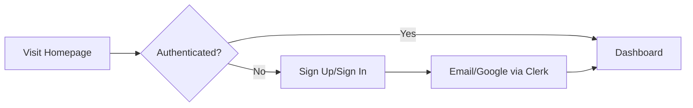

<div align="center">
  
  
  # 🎓 Converso
  
  ### *Your Next-Generation AI-Powered Learning Platform*
  
  **Redefining education with real-time, voice-driven, and interactive experiences.**
  
  [](https://nextjs.org/)
  [](https://www.typescriptlang.org/)
  [](https://supabase.com/)
  [](LICENSE)

---

### 👨‍💻 Final Year Mini Project

**Developed by:**

- **Nitin Govardhane**
- **Jitesh Borse**

_MIT-WPU | Master of Computer Applications | 2024-2026_

</div>

---

## 📖 Table of Contents

- [What is Converso?](#-what-is-converso)
- [Problem Statement](#-problem-statement)
- [Key Features](#-key-features)
- [Screenshots](#-screenshots)
- [Tech Stack](#️-tech-stack)
- [Project Scope & Objectives](#-project-scope--objectives)
- [System Flow](#-system-flow-user-journey)
- [Getting Started](#-getting-started)
- [Contributors](#-contributors)

---

## 🚀 What is Converso?

**Converso** is an innovative, customizable, **AI-powered learning platform** delivered as a **Software as a Service (SaaS)**. It empowers you to:

- 🎯 **Launch your own SaaS application**
- 📈 **Advance your development and deployment skills**
- 💰 **Build scalable, profitable products**

### Our Mission

Accelerate your journey from **MVP to monetization** while eliminating common learning barriers:

- ❌ Information overload and difficulty finding relevant content
- ❌ Struggles with understanding complex concepts
- ❌ Limited access to personalized, affordable feedback

✅ **Converso solves these challenges** by delivering a highly personalized, interactive, and engaging learning experience through real-time AI conversations.

---

## 🎯 Problem Statement

Traditional learning is often frustrating:

| Challenge                                 | Impact                                           |
| ----------------------------------------- | ------------------------------------------------ |
| 📚 **Hard to find the right information** | Time wasted searching through irrelevant content |
| 🤔 **Concepts don't "click"**             | Increased learning curve and frustration         |
| 💸 **Personalized feedback is costly**    | Limited access to quality tutoring               |

### The Converso Solution

Instead of passively reading, you **converse in real time** with an AI tutor that adapts to your needs—making complex topics accessible and ensuring you're always on track.

---

## 🌟 Key Features

<table>
  <tr>
    <td width="50%">
      
### 🎤 Voice-Driven Lessons
Engage in real-time, personalized conversations with AI tutors. Customize voice, name, subject, and teaching style.

### 🔐 Secure Authentication

Robust email/Google sign-in and comprehensive user profile controls powered by Clerk.

### 💳 Flexible Subscription Plans

Monetize with tiered pricing via **Clerk + Stripe**:

- 🥉 **Basic**
- 🥈 **Core Learner**
- 🥇 **Pro Companion**

    </td>
    <td width="50%">


### 🎨 Modern, Responsive UI/UX

Seamless experience across all devices with beautiful animations and intuitive design.

### 🔍 Search & History Tracking

Bookmark lessons, track your learning journey, and filter content with ease.

### 🤖 Companion Builder

Create tailored AI companions for focused learning sessions on any subject.

    </td>

  </tr>
</table>

### Additional Features

- 📚 **Companion Library**: Discover and filter user- and community-generated courses
- 👤 **User Profile ("My Journey")**: Monitor your progress and manage your companions
- 📝 **Real-Time Transcripts**: Access live dialogue transcriptions for review and accessibility
- 🛡️ **Automated Error Tracking**: Integrated Sentry ensures stability and reliability
- 💰 **Billing Enforcement**: Feature locking and upgrade prompts drive effective monetization

---

## 📸 Screenshots

<div align="center">

### Home Page


---

### Companion Library


---

### Learning Session


</div>

---

## ⚙️ Tech Stack

Converso is built on a modern, scalable, developer-friendly stack:

<table>
  <tr>
    <td align="center" width="33%">
      
      <br><strong>Next.js 15.4.4</strong>
      <p><small>React framework with server-side rendering, static site generation, and API routes</small></p>
    </td>
    <td align="center" width="33%">
      
      <br><strong>TypeScript 5</strong>
      <p><small>Static typing for better tooling and code quality</small></p>
    </td>
    <td align="center" width="33%">
      
      <br><strong>Supabase</strong>
      <p><small>Open-source BaaS with PostgreSQL, instant APIs, and real-time subscriptions</small></p>
    </td>
  </tr>
</table>

### Core Technologies

#### Frontend

- **[Next.js](https://nextjs.org/)** - Powerful React framework for building fast, scalable web applications
- **[TypeScript](https://www.typescriptlang.org/)** - Superset of JavaScript with static typing for reliability
- **[Tailwind CSS](https://tailwindcss.com/)** - Utility-first CSS framework for rapid UI development
- **[shadcn/ui](https://ui.shadcn.com/)** - Customizable component library built on Radix UI and Tailwind CSS
- **[Lottie React](https://github.com/Gamote/lottie-react)** - Beautiful animations for enhanced user experience

#### Backend & Services

- **[Supabase](https://supabase.com/)** - Open-source backend with PostgreSQL, instant APIs, and authentication
- **[Clerk](https://jsm.dev/converso-clerk)** - Unified platform for authentication, user management, and Stripe billing
- **[Vapi](https://jsm.dev/converso-vapi)** - Voice AI platform for conversational voice agents with low-latency interactions
- **[Sentry](https://jsm.dev/converso-sentry)** - Error tracking and performance monitoring for stability

#### Form & Validation

- **[React Hook Form](https://react-hook-form.com/)** - Performant form validation library
- **[Zod](https://zod.dev/)** - TypeScript-first schema validation ensuring data integrity

#### Development Tools

- **VS Code** - Primary development environment
- **GitHub** - Version control and collaboration
- **Vercel** - Seamless deployment and hosting

---

## 📈 Project Scope & Objectives

**Converso** is your personal AI-powered education platform—a SaaS application designed for both **learners** and **developers**. It's a launchpad for building, deploying, and monetizing SaaS products.

### Core Functionality

<table>
  <tr>
    <td width="50%">

#### 🔐 Secure Authentication

- Email/Google sign-in via Clerk
- User profile management
- Session handling

#### 🎤 Voice-Driven Lessons

- Interactive AI learning sessions
- Real-time transcriptions
- Customizable AI tutors

#### 🎨 Personalization

- Custom courses creation
- Personalized learning styles
- Subject-based filtering

    </td>
    <td width="50%">

#### 📱 Responsive UI

- Seamless experience on any device
- Modern design with animations
- Intuitive navigation

#### 🔍 Search & History

- Effortless lesson discovery
- Session history tracking
- Bookmark functionality

#### 💳 Subscription System

- Multiple pricing plans
- Integrated Stripe billing
- Feature-based access control

      </td>

    </tr>
  </table>

### Development & Monitoring

- ⚡ **Scalable Backend**: PostgreSQL via Supabase
- 🛡️ **Robust Codebase**: TypeScript for reliability
- 📊 **Error Monitoring**: Sentry integration for stability
- 🔄 **Version Control**: GitHub for collaboration

### Monetization

Subscription tiers and billing are core to the project, teaching developers how to build **profitable SaaS products**.

---

## 🔄 System Flow: User Journey

### 1️⃣ Accessing the Platform



- Visit the homepage and sign up/sign in (email or Google via Clerk)
- Restricted pages redirect unauthenticated users to sign-in

### 2️⃣ Exploring & Creating Companions

- 📚 Browse the **Companion Library** for available courses
- ➕ Use the **Companion Builder** to create a new AI tutor
  - Define name, subject, topic, voice, style, and duration
  - Billing checks enforce plan limits
  - Upgrade prompts appear as needed
- 💾 New companions are saved to Supabase
- 🎯 Redirected to session page

### 3️⃣ Engaging in Learning Sessions

- 📖 View companion and topic details
- ▶️ Start a session for real-time, voice-driven learning via Vapi
- 📝 Live transcripts and Lottie animations enhance engagement
- 💾 Sessions are recorded in your history for future review

### 4️⃣ Tracking Progress & Managing Subscriptions

- 📊 The **"My Journey"** page summarizes your learning and companions
- 📚 View recent sessions and manage companions
- 💳 Manage subscription (upgrade/switch plans via Stripe)

### 5️⃣ Behind the Scenes (for Developers)

- 🛡️ **Sentry** monitors errors and performance
- 🔄 **GitHub** enables version control and collaboration
- 🚀 **Vercel** powers seamless deployment

---

## 🚀 Getting Started

### Prerequisites

- Node.js 18+ installed
- npm or yarn package manager
- Supabase account
- Clerk account
- Vapi API key
- Sentry account (optional)

### Installation

```bash
# Clone the repository
git clone https://github.com/GovardhaneNitin/converso.git

# Navigate to project directory
cd converso

# Install dependencies
npm install

# Set up environment variables
# Create a .env.local file with your credentials

# Run development server
npm run dev
```

Visit `http://localhost:3000` to see the application.

### Build for Production

```bash
# Create optimized production build
npm run build

# Start production server
npm start
```

---

## 🚫 Out of Scope / Extensions

Converso's core is robust, but advanced features (e.g., enhanced bookmarking, social learning features, mobile apps) are left as extension opportunities—encouraging further customization and learning.

**Potential Extensions:**

- 📱 Native mobile applications (iOS/Android)
- 👥 Social learning features and study groups
- 🏆 Gamification and achievements
- 📊 Advanced analytics dashboard
- 🌍 Multi-language support beyond English
- 🎥 Video conferencing integration

---

## 👥 Contributors

<div align="center">

### Development Team

<table>
  <tr>
    <td align="center" width="50%">
      
      <br>
      <strong>Nitin Govardhane</strong>
      <br>
      <a href="https://github.com/GovardhaneNitin">
        
      </a>
    </td>
    <td align="center" width="50%">
      <strong>Jitesh Borse</strong>
      <br>
      <em>Co-Developer</em>
    </td>
  </tr>
</table>

### Academic Details

**Institution:** MIT World Peace University (MIT-WPU)  
**Program:** Master of Computer Applications (MCA)  
**Year:** 2024-2026  
**Semester:** 3rd Semester  
**Project Type:** Final Year Mini Project

</div>

---

## 📄 License

This project is part of an academic curriculum at MIT-WPU.

---

## 🙏 Acknowledgments

- Thanks to our faculty advisors for guidance and support
- MIT-WPU for providing the platform for this project
- The open-source community for excellent tools and libraries
- All the technology providers (Clerk, Supabase, Vapi, Sentry) for their amazing platforms

---

<div align="center">

### ⭐ Star this repository if you find it helpful!

**Made with ❤️ by Nitin Govardhane & Jitesh Borse**

</div>
