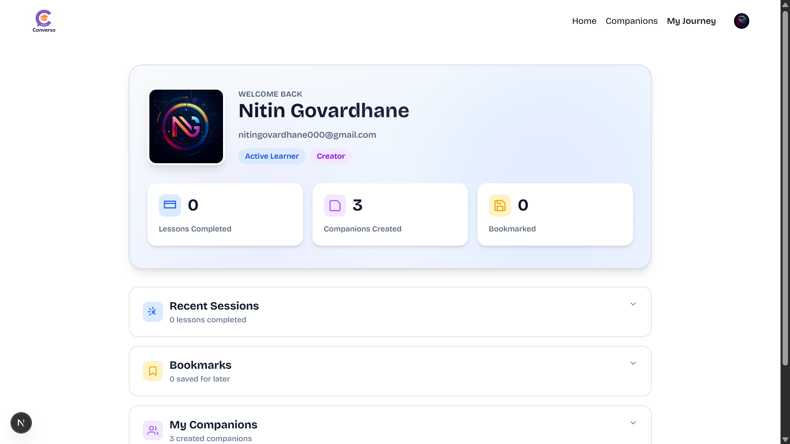
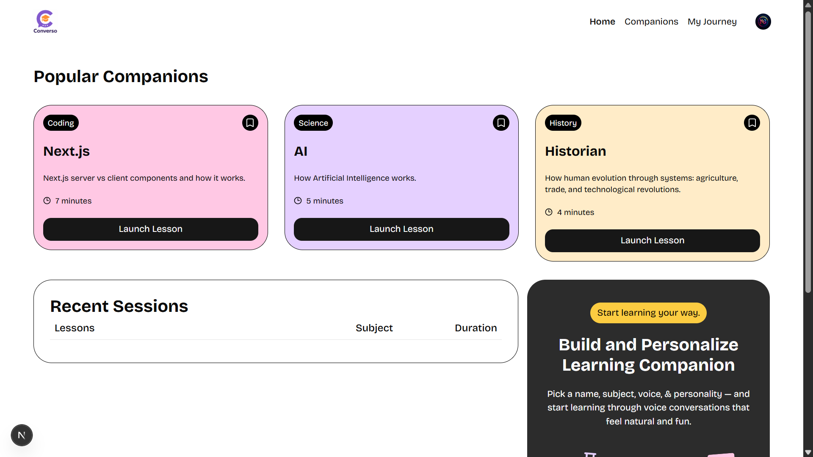
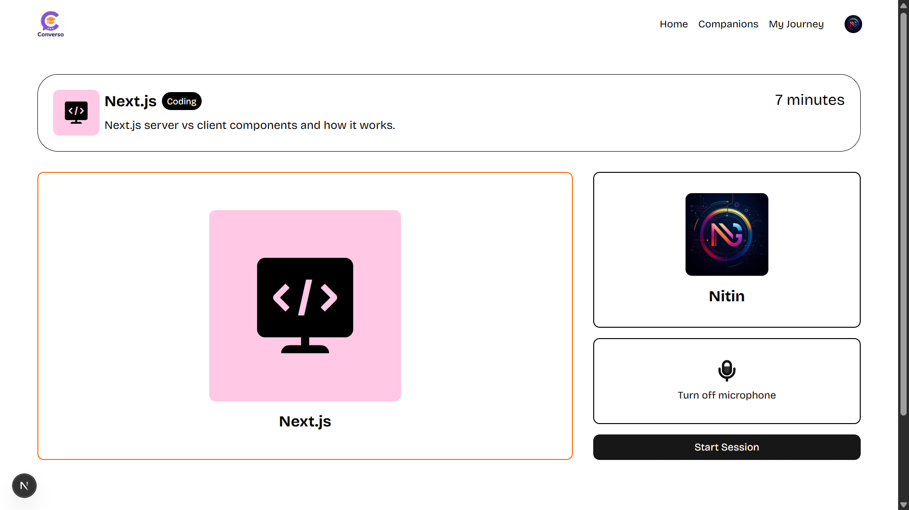

# Converso

An AI-powered learning platform that delivers real-time, voice-driven, and interactive educational experiences through conversational AI tutors.

[](https://nextjs.org/)
[](https://www.typescriptlang.org/)
[](https://supabase.com/)

**Final Year Mini Project**  
Developed by Nitin Govardhane & Jitesh Borse  
MIT-WPU | Master of Computer Applications | 2024-2026

## About Converso

Converso is a customizable AI-powered learning platform delivered as a Software as a Service (SaaS). It enables users to engage in personalized, real-time conversations with AI tutors, making complex topics accessible through interactive voice-driven learning sessions.

## Features

- Voice-driven lessons with customizable AI tutors
- Secure authentication via Clerk (Email/Google sign-in)
- Flexible subscription plans with Stripe integration
- Real-time transcripts and session history
- Companion Builder for creating personalized learning sessions
- Companion Library with search and filtering
- User profile and progress tracking
- Responsive design across all devices
- Automated error tracking with Sentry

## Screenshots

### Home Page



### Companion Library



### Learning Session



## Tech Stack

### Frontend

- Next.js - React framework with server-side rendering
- TypeScript - Static typing for reliability
- Tailwind CSS - Utility-first CSS framework
- shadcn/ui - Component library built on Radix UI
- Lottie React - Animations

### Backend & Services

- Supabase - PostgreSQL database and authentication
- Clerk - User management and Stripe billing integration
- Vapi - Voice AI platform for conversational agents
- Sentry - Error tracking and performance monitoring

### Form & Validation

- React Hook Form - Form validation
- Zod - Schema validation

## Getting Started

### Prerequisites

- Node.js 18+ installed
- npm or yarn package manager
- Supabase account
- Clerk account
- Vapi API key
- Sentry account (optional)

### Installation

```bash
# Clone the repository
git clone https://github.com/GovardhaneNitin/converso.git

# Navigate to project directory
cd converso

# Install dependencies
npm install

# Set up environment variables
# Create a .env.local file with your credentials

# Run development server
npm run dev
```

Visit `http://localhost:3000` to see the application.

### Build for Production

```bash
# Create optimized production build
npm run build

# Start production server
npm start
```

## Contributors

**Nitin Govardhane** - [GitHub](https://github.com/GovardhaneNitin)  
**Jitesh Borse** - Co-Developer

MIT World Peace University (MIT-WPU)  
Master of Computer Applications | 2024-2026
